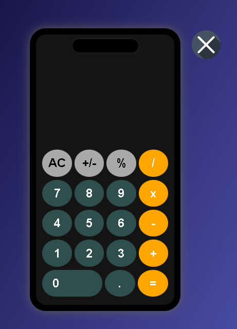
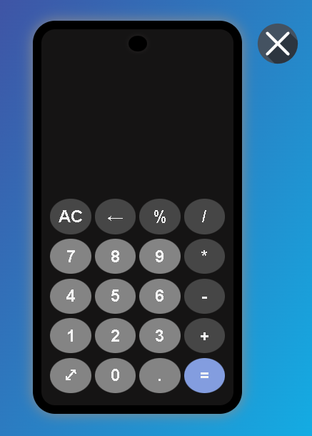
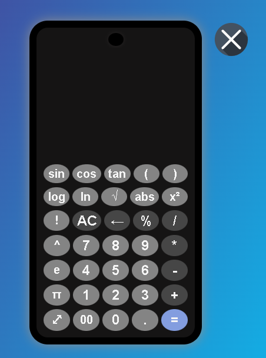

# Calculators

A simple calculator for both iOS and Android interfaces, built using HTML, CSS, and JavaScript.

---

## Features

### iOS Calculator:
- Mimics the style of Apple's default iOS calculator.
- Supports:
  - Basic operations: `+`, `-`, `×`, `÷`.
  - Percentage and sign inversion (`%`, `+/-`).
- Minimalist design with rounded buttons and hover effects.
- Responsive layout for various screen sizes.

### Android Calculator:
- Modeled after Android's native calculator.
- Supports:
  - Basic operations: `+`, `-`, `×`, `÷`.
  - Scientific functions in expandable mode: `sin`, `cos`, `tan`, `log`, `ln`, `√`, `π`, `e`, etc.
  - Percentage, factorials, and power calculations.
- Expandable and non-expandable modes:
  - **Non-expandable mode**: Basic operations in a 4xN layout.
  - **Expandable mode**: Includes scientific functions in a 5xN layout.
- Fully responsive with buttons resizing for different screen sizes.

---

## Installation

1. Clone the repository:
   ```bash
   git clone https://github.com/your-username/calculator.git
   cd calculator
   ```

2. Open the `index.html` file in any modern web browser.

---

## File Structure

- **`index.html`**: Contains the HTML structure for both calculators.
- **`main.css`**: Styles for the iOS and Android calculators, including responsiveness and hover effects.
- **`main.js`**: All the JavaScript functionality for both calculators, including event handling, calculations, and expandable mode toggle.

---

## How to Use

### iOS Calculator:
1. Click on the **iOS Calculator icon**.
2. Perform basic arithmetic operations:
   - Use the `AC` button to clear all inputs.
   - Use the `+/-` button to toggle the sign of the current number.
   - Use the `=` button to get results.

3. To return to the main menu, click the **back button**.

### Android Calculator:
1. Click on the **Android Calculator icon**.
2. Perform basic or scientific operations:
   - Use the `Expand (⤢)` button to toggle between **non-expandable** and **expandable** modes.
   - Basic operations are displayed in non-expandable mode.
   - Scientific functions appear in expandable mode.
3. Use the `AC` button to reset the calculator.
4. To return to the main menu, click the **back button**.

---

## Responsive Design

- **iOS and Android calculators** adapt to all screen sizes:
  - Buttons scale dynamically.
  - Layout adjusts for both portrait and landscape orientations.


---

## Screenshots

### iOS Calculator:


### Android Calculator (Non-Expandable):


### Android Calculator (Expandable):


---

## Technologies Used

- **HTML**: Structure and layout of the calculators.
- **CSS**: Styling for the UI and responsiveness.
- **JavaScript**: Interactive functionality and dynamic behavior.

---

## License

This project is licensed under the MIT License. See the [LICENSE](LICENSE) file for details.

---


